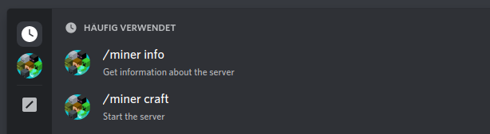
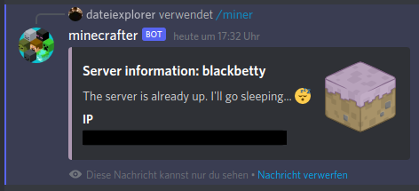

# minecrafter

Discord bot to manage minecraft servers through application commands written in
Go.

This project is a wrapper around the [paper-server-tools][pst]. You can easily
start your current server with an application command from discord.

For a sample `.env` configuration look at the example [file](.env).

## Usage

First configure the bot with environment variables. You need to install the
[paper-server-tools][pst] to make thinks work.

Then you can type e.g. `/miner craft` to start a server. To make this work
you'll need to specifiy a 'current' server first.

The bot also supports maintanance mode so that you have the full control over
all your servers and can restrict command executions.

**NOTICE: To use the commands, your user need the a role, called `miner`.**

The bot responds with private messages, e.g.

The bot stops the server automatically if no users are on the server.

## Security

The bot only accepts messages from guild members. Those members needs a role
called `miner` (case insensitive) to be allowed to execute commands.

[pst]: https://github.com/dateiexplorer/paper-server-tools